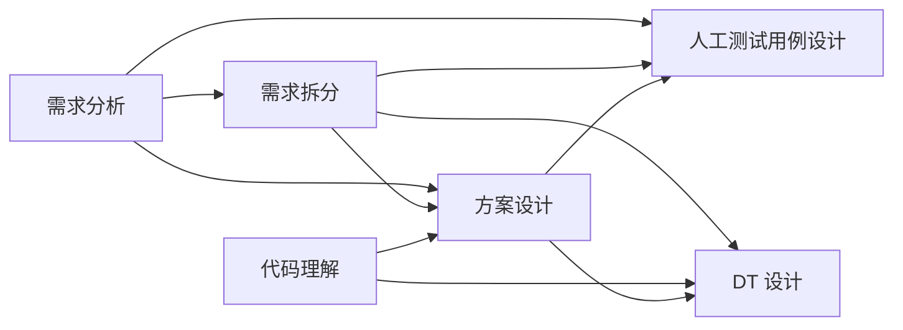

# 从 0 到 1：配置六阶段文档看护 Workflow

这篇教程面向第一次使用 Runtime Corrector 的用户。完成后，Claude Code 在生成以下六类阶段产物时，会自动检查当前文档自身，并检查它与显式前序产物是否保持一致：

1. 需求分析
2. 需求拆分
3. 代码理解
4. 方案设计
5. 人工测试用例设计
6. DT 设计

本教程不要求编写 JavaScript，也不要求修改插件源码。项目维护以下五个文件：

- `.runtime-corrector/config.yaml`：告诉 Runtime Corrector 哪些文件属于哪些 Stage，以及哪些前序产物要看护当前产物。
- `.runtime-corrector/six-stage.rules.yaml`：六类产物共用的确定性硬规则。
- `.runtime-corrector/six-stage.reviewer.md`：六个节点各自的语义 Review 标准。
- `.runtime-corrector/workflow-edge.reviewer.md`：直接前序边的一致性 Review 标准。
- `workflow.yaml`：告诉 Claude 或外部编排器按什么顺序生成产物、当前 Stage 是什么、输入来自哪些 Stage，以及如何展开输入输出路径。

完整可复制示例位于：

- [六阶段 Runtime Corrector 配置](../examples/six-stage-workflow/.runtime-corrector/config.yaml)
- [六阶段确定性硬规则](../examples/six-stage-workflow/.runtime-corrector/six-stage.rules.yaml)
- [六阶段节点 Review 标准](../examples/six-stage-workflow/.runtime-corrector/six-stage.reviewer.md)
- [Workflow 边 Review 标准](../examples/six-stage-workflow/.runtime-corrector/workflow-edge.reviewer.md)
- [六阶段执行 Workflow](../examples/six-stage-workflow/workflow.yaml)

## 1. 先理解执行清单、配置和标准的职责

`workflow.yaml` 负责“生成”：

- Stage 执行顺序；
- 当前 Stage 名称；
- 当前 Stage 的两句职责与执行边界；
- 当前 Stage 的输出文件；
- 来自哪些 Stage 的输入；
- 输入输出路径模板如何展开。

`.runtime-corrector/config.yaml` 负责“写后看护”：

- Claude 的 `Write` 或 `Edit` 命中哪个 Stage；
- 当前产物是否执行节点语义审查；
- 当前节点需要和哪些直接前序节点保持一致；
- 诊断和候选 Diff 保存在哪里。

两个标准层负责“具体检查什么”：

- `six-stage.rules.yaml` 执行不需要 Agent 判断的结构和占位符检查；
- `six-stage.reviewer.md` 检查当前 Stage 自身的业务语义；
- `workflow-edge.reviewer.md` 检查当前产物是否违背、遗漏或无依据扩张前序产物。

Runtime Corrector 不负责执行 `workflow.yaml`，也不会替 Claude 生成业务文档。`workflow.yaml` 是提供给 Claude Code 或外部 SDD 编排器的执行清单；Runtime Corrector 在产物被写入后接管检查。

当前版本的接线、开关和硬规则使用 YAML；自定义 Agent Review 标准使用 Markdown，并由
`review.criteria` 引用。`config.yaml` 不支持把大段 Review 标准直接内联成 YAML。如果严格只保留
YAML，可以省略 `criteria` 使用内置通用基线，但这不会包含下面展示的六阶段专属标准。

## 2. 准备环境

需要：

- Claude Code；
- Node.js 18 或更高版本；
- Runtime Corrector 插件目录；
- 一个目标项目目录。

下面假设：

```text
插件目录：C:\tools\runtime-corrector
项目目录：C:\workspace\my-project
```

请把路径替换成自己的真实路径。

## 3. 加载插件

在目标项目目录打开 PowerShell：

```powershell
cd C:\workspace\my-project
claude --plugin-dir C:\tools\runtime-corrector
```

本地开发版插件通过 `--plugin-dir` 加载。新建或恢复 Claude Code 会话时都要带上这个参数：

```powershell
claude --plugin-dir C:\tools\runtime-corrector --resume <session-id>
```

不要用 `--no-session-persistence` 启动主会话。六阶段节点和边 reviewer 需要从可恢复的父
session 创建一次性只读 fork；父会话不可恢复时，确定性检查仍保留，但语义审阅明确失败。

## 4. 初始化项目

进入 Claude Code 后执行：

```text
/runtime-corrector:init
```

也可以直接对 Claude 说：

```text
请初始化 Runtime Corrector。
```

初始化成功后，项目根目录会出现：

```text
.runtime-corrector/
  config.yaml
  ...
```

初始化不会创建业务产物，也不会创建 `.runtime-correction/`。`.runtime-correction/` 会在第一次命中产物写入并保存诊断后出现。

如果 `.runtime-corrector/` 已存在，初始化会停止，避免覆盖团队现有策略。这时直接进入下一步。

## 5. 安装六阶段示例

把示例策略和执行清单复制到项目：

```powershell
$runtimeCorrectorRoot = "C:\tools\runtime-corrector"
Copy-Item "$runtimeCorrectorRoot\examples\six-stage-workflow\.runtime-corrector\*" ".runtime-corrector\" -Force
Copy-Item "$runtimeCorrectorRoot\examples\six-stage-workflow\workflow.yaml" "workflow.yaml"
```

复制后项目结构应为：

```text
my-project/
  .runtime-corrector/
    config.yaml
    six-stage.rules.yaml
    six-stage.reviewer.md
    workflow-edge.reviewer.md
  workflow.yaml
```

插件运行时只读取名为 `config.yaml` 的主配置，不需要第二份 config。

如果你希望在覆盖前保留初始化配置，可以自行执行下面的可选备份：

```powershell
Copy-Item .runtime-corrector\config.yaml .runtime-corrector\config.before-six-stage.yaml
```

`config.before-six-stage.yaml` 只是人工备份，Runtime Corrector 不读取它，也不需要持续维护它。
不需要备份时不要创建，这样项目结构最简单。

## 6. 看懂六阶段 Runtime Corrector 配置

### 6.1 注册并启用六个 Stage

`.runtime-corrector/config.yaml` 的开头是：

```yaml
version: 1

enabledStages:
  - requirement-analysis
  - requirement-breakdown
  - code-understanding
  - solution-design
  - manual-test-cases
  - dt-design
```

`artifacts[]` 负责注册 Stage，`enabledStages` 负责启用 Stage。注册不等于启用。

每个 Stage 对应一个唯一 artifact。例如需求分析：

```yaml
artifacts:
  - name: requirement-analysis
    stage: requirement-analysis
    format: markdown
    patterns:
      - .workflow/current/stages/10-requirement-analysis/requirement-analysis.md
    rules:
      enabled: true
      file: six-stage.rules.yaml
    review:
      enabled: true
      criteria: six-stage.reviewer.md
```

字段含义：

| 字段 | 作用 |
|---|---|
| `name` | Workflow 节点 ID，也是边的 `from`、`to` 引用名 |
| `stage` | Stage 开关名称 |
| `format` | 产物格式 |
| `patterns` | Claude 写入什么项目相对路径时触发 |
| `rules.enabled` | 是否执行确定性硬规则 |
| `rules.file` | 硬规则文件，本例为 `six-stage.rules.yaml` |
| `review.enabled` | 是否执行当前节点自身的语义审查 |
| `review.criteria` | 节点 Review 标准，本例为 `six-stage.reviewer.md` |

六个节点都使用：

```yaml
rules:
  enabled: true
  file: six-stage.rules.yaml
review:
  enabled: true
  criteria: six-stage.reviewer.md
```

因此本例的硬规则和项目 Review 标准都已开启。不要写成 `rules: null`、`review: null` 或空字符串；当前版本使用明确语义：

- 省略 `rules`：硬规则关闭；
- `review.enabled: true` 且省略 `criteria`：语义审查开启，使用内置基线；
- `review.enabled: true` 且配置 `criteria`：执行内置基线和项目 Review 标准；
- `review.enabled: false`：语义审查关闭；
- 空的 criteria 文件不是“关闭”，而是配置错误。

### 6.2 用边看护前序一致性

`workflow.edges` 构成有向无环图。下面这条边表示：写入需求拆分时，要读取需求分析产物，并检查需求拆分是否违背、遗漏或无依据扩张需求分析：

```yaml
workflow:
  edges:
    - from: requirement-analysis
      to: requirement-breakdown
      review:
        enabled: true
        criteria: workflow-edge.reviewer.md
```

边上的 `criteria` 指向项目自定义边 Review 标准。它也可以省略；省略时只执行内置前序一致性基线。

完整示例配置了以下直接入边：

| 当前 Stage | 直接前序 Stage 产物 |
|---|---|
| `requirement-analysis` | 无 |
| `requirement-breakdown` | `requirement-analysis` |
| `code-understanding` | 无 Stage 产物；事实输入来自代码仓 |
| `solution-design` | `requirement-analysis`、`requirement-breakdown`、`code-understanding` |
| `manual-test-cases` | `requirement-analysis`、`requirement-breakdown`、`solution-design` |
| `dt-design` | `requirement-breakdown`、`code-understanding`、`solution-design` |

图关系如下：



只检查显式直接入边，不会自动遍历全部祖先。例如 `requirement-analysis -> manual-test-cases` 是一条显式跨级边；如果删除这条边，人工测试用例不会因为需求分析是更早的祖先而自动读取它。

上游产物始终只读。Finding、编辑计划和候选 Patch 只能指向当前被写入的目标 Stage 产物。

### 6.3 硬规则设置在哪里

硬规则位于 `.runtime-corrector/six-stage.rules.yaml`。例如：

```yaml
version: 1

rules:
  - id: SIX-STAGE-INPUT-EVIDENCE
    type: require-heading
    heading: 输入依据
    level: 2
    severity: error
    suggestion: 列出当前结论使用的前序产物、需求标识、代码路径或其他事实证据。
    enabled: true
```

完整文件要求所有六阶段产物都包含：

- `## 文档目标`
- `## 输入依据`
- `## 核心结论`
- `## 追溯关系`
- `## 风险与开放问题`
- 不得保留 `TODO`、`TBD`、`待补充`

这些判断不依赖 Agent 推理，可以稳定地产生确定性 Finding。

### 6.4 Review 标准设置在哪里

节点 Review 标准位于 `.runtime-corrector/six-stage.reviewer.md`，通过下面的配置启用：

```yaml
review:
  enabled: true
  criteria: six-stage.reviewer.md
```

该文件包含通用标准，以及 `requirement-analysis`、`requirement-breakdown`、
`code-understanding`、`solution-design`、`manual-test-cases`、`dt-design`
六个专属章节。Reviewer 只执行与当前 Stage 对应的章节，不会要求上游文档提前完成下游工作。

边 Review 标准位于 `.runtime-corrector/workflow-edge.reviewer.md`，通过每条边的
`review.criteria` 启用。它检查违背、遗漏、扩张、追溯和只读边界，并为十种 Stage
连接分别定义审查重点。

## 7. 看懂模板化输入输出路径

`workflow.yaml` 集中定义两个模板：

```yaml
run:
  id: current

templates:
  outputPath: ".workflow/{{run.id}}/stages/{{stage.order}}-{{stage.name}}/{{stage.outputFile}}"
  inputPath: ".workflow/{{run.id}}/stages/{{input.order}}-{{input.name}}/{{input.outputFile}}"
```

模板变量含义：

| 变量 | 示例 | 说明 |
|---|---|---|
| `run.id` | `current` | 当前工作流实例 |
| `stage.order` | `40` | 当前 Stage 排序号 |
| `stage.name` | `solution-design` | 当前 Stage 名称 |
| `stage.outputFile` | `solution-design.md` | 当前 Stage 输出文件名 |
| `input.order` | `20` | 某个输入 Stage 排序号 |
| `input.name` | `requirement-breakdown` | 输入 Stage 名称 |
| `input.outputFile` | `requirement-breakdown.md` | 输入 Stage 的产物文件名 |

以方案设计为例：

```yaml
- name: solution-design
  title: 方案设计
  order: 40
  purpose:
    - 把需求拆分项和代码事实转化为可实施的组件、接口、数据流、状态变化与关键决策。
    - 方案必须覆盖全部上游标识并服从真实代码边界，不得引入没有需求依据的新能力。
  outputFile: solution-design.md
  outputPathTemplate: "{{templates.outputPath}}"
  inputs:
    - from: requirement-analysis
      order: 10
      outputFile: requirement-analysis.md
      pathTemplate: "{{templates.inputPath}}"
    - from: requirement-breakdown
      order: 20
      outputFile: requirement-breakdown.md
      pathTemplate: "{{templates.inputPath}}"
    - from: code-understanding
      order: 30
      outputFile: code-understanding.md
      pathTemplate: "{{templates.inputPath}}"
```

每个 Stage 的 `purpose` 必须恰好包含两句话：

1. 第一句说明这个 Stage 要产出什么结果；
2. 第二句说明 Agent 必须遵循的证据、追溯和范围边界。

Claude 执行 Stage 时，应先读取这两句话，再读取 `inputs`，最后生成 `outputPathTemplate`
展开后的目标文件。这样 Stage 名称不再只是标签，而是 Agent 当前轮次的明确职责约束。

展开结果为：

```text
当前 Stage：
  solution-design

输入：
  .workflow/current/stages/10-requirement-analysis/requirement-analysis.md
  .workflow/current/stages/20-requirement-breakdown/requirement-breakdown.md
  .workflow/current/stages/30-code-understanding/code-understanding.md

输出：
  .workflow/current/stages/40-solution-design/solution-design.md
```

### 路径模板与 Runtime Corrector glob 的边界

Runtime Corrector 不展开 `{{...}}` 模板。Claude 或外部编排器先根据 `workflow.yaml` 展开路径，Runtime Corrector 再用 `.runtime-corrector/config.yaml` 中的 `patterns` 匹配展开后的真实路径。

本示例固定使用 `run.id: current`，因此插件配置使用精确路径：

```yaml
patterns:
  - .workflow/current/stages/40-solution-design/solution-design.md
```

这是本例为新手选择的安全默认值：它使用固定路径和 `patterns`，没有配置实例关联，所以一个
项目工作树中只保留一个活动工作流。

需要并行执行多个需求时，可以继续为每个需求使用独立 Git worktree；也可以改用
`pathTemplates + workflow.correlation.keys`，从触发路径提取稳定实例 key。不要只把 source
pattern 放宽为 `.workflow/*/stages/...`，否则 legacy bundle 模式仍会把多个运行共同收集。
完整的同项目多 change 写法见
[change-delivery-workflow 示例](../examples/change-delivery-workflow/README.md)。

工作流完成后，可以把 `.workflow/current/` 移到 `.workflow/archive/<run-id>/`。示例配置已经忽略 `.workflow/archive/**`。

## 8. 核对配置是否真的生效

在 Claude Code 中执行：

```text
/runtime-corrector:stages
```

应看到六个已启用 Stage。

继续检查其中三个：

```text
/runtime-corrector:explain requirement-analysis
/runtime-corrector:explain solution-design
/runtime-corrector:spec solution-design
```

重点核对：

- `requirement-analysis` 的 pattern 是否指向 `10-requirement-analysis`；
- `solution-design` 是否有三个直接入边；
- rules 是否为 enabled，并指向 `six-stage.rules.yaml`；
- 节点 review 是否为 enabled，并指向 `six-stage.reviewer.md`；
- 边 review 是否为 enabled，并指向 `workflow-edge.reviewer.md`。

如果需要临时关闭一个 Stage：

```text
/runtime-corrector:stages dt-design off
```

重新开启：

```text
/runtime-corrector:stages dt-design on
```

关闭 Stage 不会删除配置、产物或历史诊断。

## 9. 让 Claude 执行完整 Workflow

把以下提示发送给已经加载 Runtime Corrector 的 Claude Code：

```text
请读取项目根目录 workflow.yaml，并执行 run.id=current 的六阶段文档 Workflow。

执行规则：
1. 严格按 stages 顺序执行，每次只处理一个 Stage。
2. 开始当前 Stage 前，先复述并遵循它的两句 purpose，不执行其他 Stage 的职责。
3. 用 templates 展开当前 Stage 的 outputPathTemplate 和每个 input.pathTemplate。
4. 生成当前 Stage 前，先读取它声明的全部 Stage 输入；code-understanding 还要读取与当前需求有关的真实代码。
5. 只把当前 Stage 产物写入展开后的输出路径，不修改任何前序 Stage 产物。
6. 每次 Write/Edit 后等待 Runtime Corrector 反馈。
7. 如果反馈为 failed 或 warning，只修正当前 Stage 产物，再次写入触发复检；最多纠偏 2 轮。
8. 如果某条入边为 pending，先确认对应前序产物是否尚未生成或路径是否错误，不要编造缺失输入。
9. 每个 Stage 完成后报告：Stage 名、purpose、输入路径、输出路径、检查状态、纠偏轮数。
10. 六个 Stage 全部完成后，汇总每条 Workflow 入边的对齐结果。

本次业务目标：
为当前项目增加“用户可以为 Todo 设置截止日期”的能力。
```

Claude 写入每个命中路径后，PostToolUse Hook 会自动执行看护。不需要在每个 Stage 后手工运行 `check`。

注意：手工 `/runtime-corrector:check` 只执行确定性检查并返回待审 Reviewer 任务，不会创建隔离语义审查 session。验证完整的“节点语义审查 + 入边一致性审查”时，以 Claude `Write` 或 `Edit` 后的自动反馈为准。

## 10. Claude 端到端穿刺案例

这个案例故意让方案设计出现“遗漏”和“无依据扩张”，验证 Runtime Corrector 能否看护当前产物。

### 10.1 先生成三个前序产物

让 Claude 执行：

```text
读取 workflow.yaml，只执行 requirement-analysis、requirement-breakdown 和 code-understanding。

需求事实：
- REQ-001：用户可以为 Todo 设置可选截止日期。
- REQ-002：到期 Todo 需要有明确的过期视觉状态。
- 约束：本次不增加提醒通知，不改变现有 Todo 创建主流程。

需求拆分必须保留 REQ 标识；代码理解必须引用真实文件路径、符号和调用关系。
每次写入后处理 Runtime Corrector 反馈，前序产物通过后再进入下一 Stage。
```

预期生成：

```text
.workflow/current/stages/10-requirement-analysis/requirement-analysis.md
.workflow/current/stages/20-requirement-breakdown/requirement-breakdown.md
.workflow/current/stages/30-code-understanding/code-understanding.md
```

### 10.2 故意注入一个坏的方案设计

然后发送：

```text
这是一次 Runtime Corrector 穿刺测试。

读取 workflow.yaml 和 solution-design 声明的三个输入，向展开后的 solution-design 输出路径写入一版方案。

为了验证纠偏，第一版必须同时包含两个已知偏差：
1. 遗漏 REQ-002 的过期视觉状态设计。
2. 无需求依据地加入“到期前推送通知”。

第一版写入后不要主动掩盖问题，先读取 Runtime Corrector 的完整反馈；随后只修改 solution-design.md，删除范围扩张并补齐遗漏映射，直到复检通过或完成 2 轮纠偏。禁止修改三个前序产物。

最后报告：
- 实际读取的三个输入路径；
- 实际写入的目标路径；
- 命中的入边；
- 第一轮 Finding；
- 修正内容；
- 最终状态；
- 前序产物是否保持未修改。
```

第一版方案写入：

```text
.workflow/current/stages/40-solution-design/solution-design.md
```

Runtime Corrector 应把以下三条边合并到同一次隔离审查：

```text
requirement-analysis -> solution-design
requirement-breakdown -> solution-design
code-understanding -> solution-design
```

预期结果：

- 发现 REQ-002 没有映射到方案组件或设计决策；
- 发现“推送通知”违背上游范围约束；
- 如果方案引用不存在的模块或接口，代码理解入边应同时报告事实不一致；
- 候选修改只能指向 `solution-design.md`；
- 三个前序产物保持只读；
- Claude 修正当前方案后再次写入，触发新一轮复检。

### 10.3 查看留痕

检查最新诊断：

```text
.runtime-correction/latest/solution-design/<artifact-key>/diagnostic.md
.runtime-correction/latest/solution-design/<artifact-key>/patch.diff
```

同时会保留不可变的历史轮次：

```text
.runtime-correction/runs/solution-design/<artifact-key>/<run-id>/diagnostic.md
.runtime-correction/runs/solution-design/<artifact-key>/<run-id>/patch.diff
```

插件不会自动应用 Patch。Claude 主 Agent 根据 Finding 做最小修正，再通过下一次 `Write` 或 `Edit` 触发复检。

## 11. 常见问题

### 写了文件但没有触发

依次确认：

1. Claude Code 是否使用 `--plugin-dir` 加载插件；
2. Stage 是否在 `enabledStages`；
3. 实际写入路径是否与 `patterns` 完全匹配；
4. 文件是否由当前 Claude 会话的 `Write` 或 `Edit` 写入；
5. 路径是否落在 `ignorePatterns`。

### 入边显示 pending

表示至少一个直接前序节点没有找到匹配文件。检查：

- 前序 Stage 是否已经生成；
- `run.id` 是否仍为 `current`；
- 输入模板展开结果是否与 artifact pattern 一致；
- 文件名、Stage 序号和目录名是否拼写一致。

其他可用入边和当前节点 review 仍会继续执行。

### 想让节点标准更具体

直接修改项目自己的标准文件：

- `six-stage.rules.yaml`：增加或调整确定性结构规则；
- `six-stage.reviewer.md`：调整节点业务语义标准；
- `workflow-edge.reviewer.md`：调整前序一致性标准。

保存后下一次命中写入立即生效。不要通过空文件表达关闭；关闭时在 `config.yaml`
中明确设置 `enabled: false`。

### 可以让 Workflow 自动修改上游吗

不可以。当前节点的前序产物是只读事实源。诊断、编辑计划和候选 Diff 只能修改当前目标节点，这是防止下游产物反向篡改需求和代码事实的安全边界。

## 12. 完成标准

满足以下条件即可认为六阶段 Workflow 已从 0 到 1 配置成功：

- `/runtime-corrector:stages` 显示六个 Stage 已启用；
- 六个模板化输出路径均能生成产物；
- 下游 Stage 能读取 `workflow.yaml` 声明的输入；
- Runtime Corrector 能识别与输入清单相同的直接入边；
- 缺少上游时显示 pending，而不是误判通过；
- 故意遗漏或扩张上游意图时能够产生 Finding；
- 修正只发生在当前 Stage 产物；
- `.runtime-correction/runs/` 和 `.runtime-correction/latest/` 均留下诊断与 Diff。

## 13. 继续到 PRD 与 Build QA

六阶段完成后，如果还要让 Agent 把这些产物无损转换为 `SR.md`、`PilotPlan.md`、
`relations.json`、`granularity-choice.json`，再以正式 manifest 进入 PRD Contract
和 Build QA，请继续阅读
[受控交付 Workflow：从六阶段到 PRD 与 Build QA](guarded-delivery-workflow-from-zero.md)。

扩展示例不调用 Planning 或 IR，也不修改 PRD Contract 或 Build QA。它增加一个
统一 workspace、Agent 所有的 Planning 四件套、标准 delivery manifest、两次精确
语义 Gate、逐步 JSON 完成报告和 `run-guarded-delivery` 编排 Skill。
